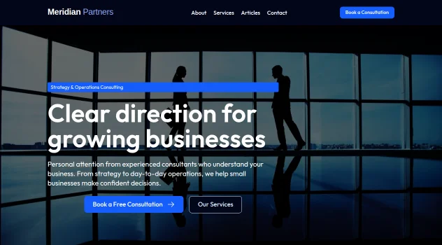

# Palcera Brochure

A polished brochure **site template for Drupal CMS**: services, team, articles, and a
9-section Canvas home page — with a Schema.org content model, SEO defaults, search, and
demo content ready to replace with your own.



## What you get

- **9-section Canvas home page** — hero, stats band, services grid, two feature sections,
  team grid, latest articles, testimonial, and call-to-action.
- **Content model with Schema.org mappings** (via `schemadotorg`): Person, Article,
  Service, and General Page content types with JSON-LD output.
- **Canvas content templates** for card + full view modes (articles, people, services),
  listing pages (`/articles`, `/team`, `/services`) built as Canvas pages with Views blocks.
- **SEO defaults** — metatags with sensible token fallbacks, XML sitemap, pathauto
  patterns, redirects, breadcrumbs.
- **Search**, cookie consent (Klaro), contact + webforms, editorial accessibility checks
  (Editoria11y), and the Drupal CMS admin experience (Gin, dashboard).
- **Neutral demo content** — a fictional consultancy ("Meridian Partners") you can edit or
  delete; all images ship with the template.

## Requirements

- Drupal CMS 2.1+ (Drupal core ^11.4)
- The [Palcera theme](https://github.com/palcera/palcera_theme) (installed automatically)

## Installation

Add the template to a Drupal CMS project and install the site using this recipe:

```bash
# The template currently carries three not-yet-stable dependencies
# (schemadotorg alpha, webform RC, palcera_theme beta) — allow them first:
composer config minimum-stability dev
composer config prefer-stable true

composer require palcera/palcera_brochure
drush site:install --site-name="My Site" recipes/palcera_brochure
```

Or select **Palcera Brochure** in the Drupal CMS installer when the template is present
in your project.

## After installing

1. Replace the demo company name, contact details, and logo (Appearance → Palcera settings).
2. Edit or delete the demo people, services, and articles.
3. Review `recommended.yml` add-ons in the Project Browser.

## License

GPL-2.0-or-later. See [LICENSE.txt](LICENSE.txt). Demo image licensing is documented in
[LICENSES-images.md](LICENSES-images.md). Security policy: [SECURITY.md](SECURITY.md).

A CycloneDX software bill of materials ([sbom.cdx.json](sbom.cdx.json)) is included as an
optional convenience — it is **not** a Drupal CMS marketplace requirement (verified
2026-07-02). It was generated with `cyclonedx/cyclonedx-php-composer` from an installed
build and reflects the dependency tree at generation time.
